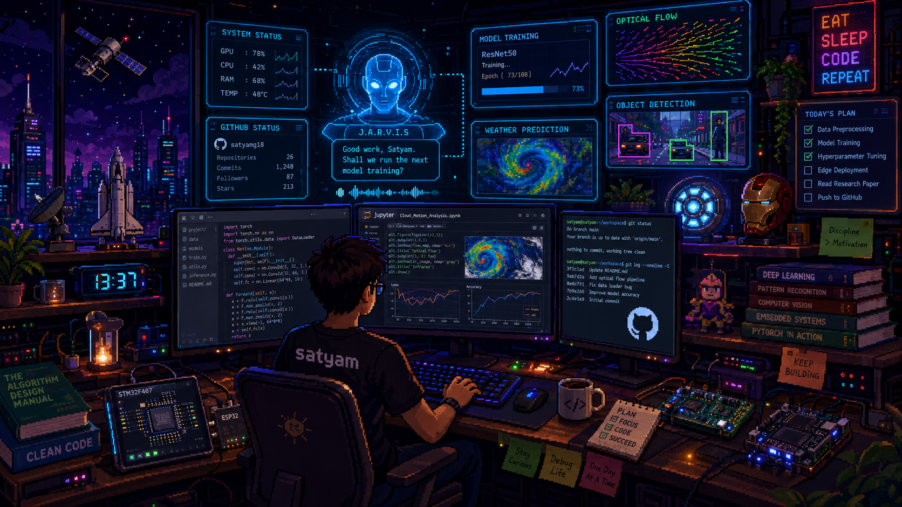

 

  
   
  <i>Double-click on the pic to open the interactive workstation! 🖥️</i>

 

---

### 🌟 About Me

I'm an Electrical and Computer Engineering student at **Shiv Nadar Institution of Eminence**, passionate about ML, Deep Learning, and building intelligent systems from the ground up.

- 🎓 B.Tech ECE @ **Shiv Nadar Institution of Eminence (SNIoE) '28**
- 🤖 Deep-diving into **Machine Learning & Deep Learning** - from classical algorithms to neural nets
- 🧠 Currently learning: **Transformers, CNNs, and end-to-end ML pipelines**
- 📫 Reach me: [18satyam.gupta@gmail.com](mailto:18satyam.gupta@gmail.com)
- ⚡ Fun fact: I think in matrices — to me, every image, sentence, and dataset is just numbers waiting to reveal a pattern 🧮

---

### 🛠️ Languages and Tools

#### 🖥️ Languages
    

#### 🤖 ML & Deep Learning
  

#### 🔌 Embedded & Hardware
   

#### 📊 Data Science & Analysis
  

#### ⚙️ Tools & Platforms
      

---

### 🛠️ Featured Projects

| Project | Description | Stack |
|:--------|:------------|:------|
| [self-shielding](https://github.com/isatyam18/self-shielding) | AI-powered counterfeit product detection via QR scan telemetry, geographic anomaly analysis, and a 6-pillar trust score engine. | HTML · CSS · JavaScript |
| [LeetcodeAI](https://github.com/isatyam18/LeetcodeAI) | Automate LeetCode progress tracking, daily streaks, and Hashnode publishing. | Python · APIs · Automation |
| [Baby-Snake-Game](https://github.com/isatyam18/Baby-Snake-Game) | Interactive snake game built as the final project of Stanford's Code in Place (CS106A). | Python · CS106A Graphics |

---

### 📊 Analytics & Activity

  

  
  

 

<picture>
  <source media="(prefers-color-scheme: dark)" srcset="https://raw.githubusercontent.com/isatyam18/isatyam18/output/github-contribution-grid-snake-dark.svg">
  <source media="(prefers-color-scheme: light)" srcset="https://raw.githubusercontent.com/isatyam18/isatyam18/output/github-contribution-grid-snake.svg">
  
</picture>

---

### 🤝 Let's Connect

I'm always open to collaborating on ML/DL projects, research, or just geeking out about AI. 
Feel free to reach out - let's build something cool together! 🚀

 

 

*"In God we trust; all others must bring data." - W. Edwards Deming*

